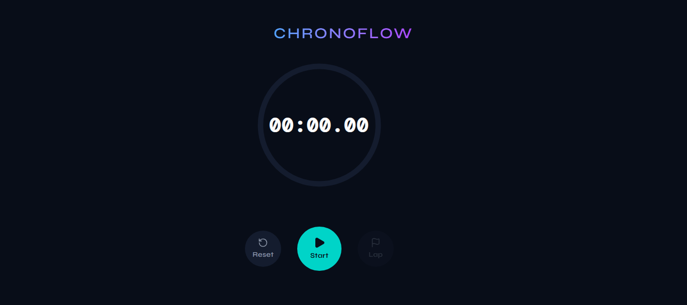
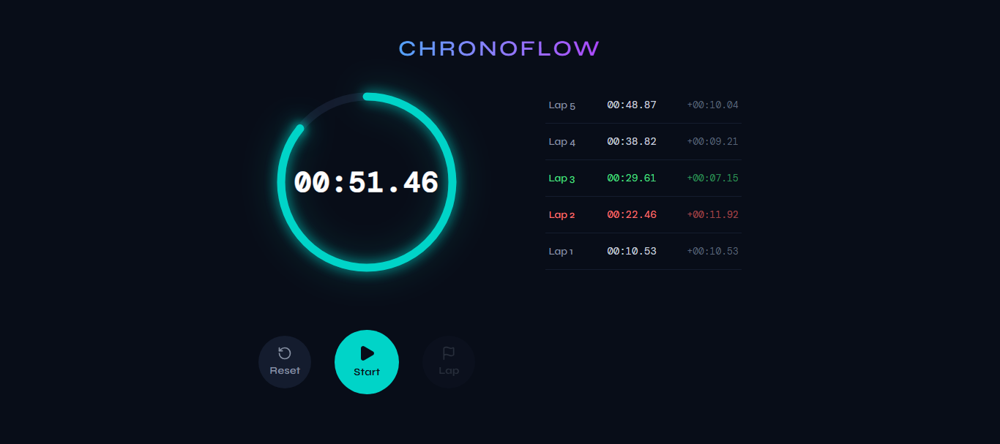

<div align="center">

# ⏱️ ChronoFlow

**A high-performance, precision stopwatch with a sleek dark-themed UI.**

[](https://reactjs.org/)
[](https://www.typescriptlang.org/)
[](https://vitejs.dev/)
[](https://tailwindcss.com/)

### 🔗 [Live Demo](https://chronoflow-hardik.vercel.app) | [GitHub](https://github.com/HardikSoni1994/ChronoFlow)

</div>

<br />

> **ChronoFlow** is built with a "Functionality First, Presentation Second" approach. It ensures true millisecond accuracy by eliminating JavaScript interval drift, all wrapped in a premium, responsive interface.

---

## 🚀 Live Preview

🌐 **Live URL:** [https://chronoflow-hardik.vercel.app](https://chronoflow-hardik.vercel.app)




---

## ✨ Core Features

* 🎯 **Precision Timing** — Utilizes `Date.now()` delta calculations to completely bypass native `setInterval` drift for 100% accurate millisecond tracking.
* ⛳ **Advanced Lap Tracking** — Seamlessly records absolute time alongside individual lap durations.
* 🚦 **Smart Highlighting** — Automatically calculates and color-codes the fastest (green) and slowest (red) laps in real-time.
* 💫 **Interactive UI Components** — Features a dynamic, glowing SVG progress ring that visually tracks the 60-second cycle.
* 📱 **Responsive Architecture** — Built with Tailwind CSS for a flawless layout that adapts perfectly from desktop (side-by-side) to mobile (stacked).

---

## 🛠️ Quick Start

Follow these steps to run ChronoFlow on your local machine.

### Prerequisites

* Node.js (v18 or higher)
* npm

### Installation

**1. Clone the repository**
```bash
git clone https://github.com/HardikSoni1994/ChronoFlow.git
cd ChronoFlow
```

**2. Install dependencies**
```bash
npm install
```

**3. Start the development server**
```bash
npm run dev
```

---

## 👨‍💻 Author

**Hardik Soni**
- GitHub: [@HardikSoni1994](https://github.com/HardikSoni1994)
- LinkedIn: [Hardik Soni](https://linkedin.com/in/hardik-soni)
